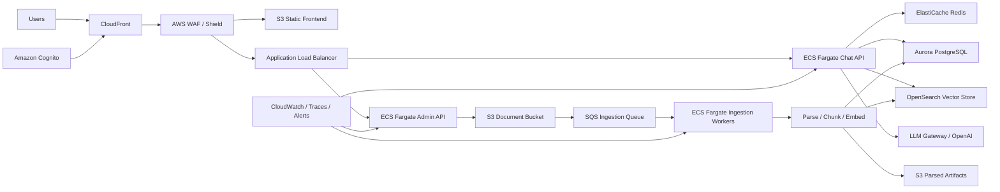
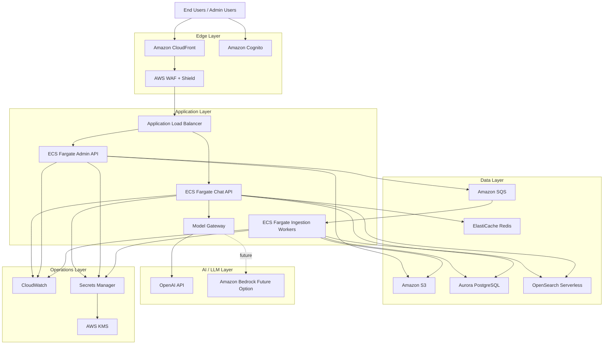

# AWS Scaling HLD for 100,000 Users

## Purpose

This document describes how to evolve `RagChatBotFAQs` from a local or small-team RAG chatbot into a production-grade AWS deployment that can support roughly 100,000 registered users with secure document ingestion, scalable retrieval, and reliable chat performance.

This is a high-level design, not a final implementation specification. It is intended to guide architecture decisions, phased rollout, and cost/performance planning.

## Scope

This HLD covers:

- target scale assumptions
- target AWS architecture
- request and ingestion flows
- scaling and reliability strategy
- security and tenant isolation
- observability and operations
- phased implementation roadmap

This HLD does not cover:

- detailed Terraform or CloudFormation
- exact AWS cost estimates
- low-level schema design
- final IAM policy definitions

## Scale Assumptions

The system should initially be designed for:

- 100,000 registered users
- 5,000 to 10,000 daily active users
- 300 to 1,000 concurrent users during peak periods
- 50 to 200 chat requests per second during bursts
- multiple corpora, uploaded by admins or support teams

If the actual goal is 100,000 concurrent users, the design must be expanded with larger inference capacity, more aggressive caching, and stricter regional failover planning.

## Current Gaps in the Existing App

The current project is suitable for local development and early demos, but several components must be replaced before large-scale production use:

- local file storage must move to Amazon S3
- local Chroma persistence must move to a managed vector-capable store
- single-process API deployment must move to autoscaled containers
- synchronous ingestion must become asynchronous and queue-driven
- local session storage must move to a managed cache and database
- authentication and authorization must be added

## Target AWS Architecture

### Core Components

- `Amazon S3`: raw uploads, parsed artifacts, manifests, and static frontend hosting
- `Amazon CloudFront`: global content delivery and edge caching
- `AWS WAF` and `AWS Shield`: request filtering, bot protection, and DDoS resilience
- `Amazon Cognito`: authentication, JWT issuance, and optional SSO
- `Application Load Balancer`: API entry point for backend services
- `Amazon ECS Fargate`: chat API, admin API, ingestion workers
- `Amazon SQS`: durable asynchronous ingestion queue
- `AWS Step Functions`: optional orchestration for multi-stage ingestion flows
- `Amazon OpenSearch Serverless` or `Amazon OpenSearch Service`: vector and hybrid retrieval
- `Amazon Aurora PostgreSQL`: metadata, users, corpora, audit trails, and operational state
- `Amazon ElastiCache for Redis`: hot cache, recent sessions, rate-limit counters
- `AWS Secrets Manager` and `AWS KMS`: secret storage and encryption
- `Amazon CloudWatch` and tracing stack: logs, metrics, alarms, traces
- `OpenAI API` initially, with a later option to abstract toward `Amazon Bedrock`

### Logical Diagram

### HLD Block Diagram

This block diagram is meant for high-level reviews with engineering, cloud, or leadership teams. The earlier logical diagram remains useful when discussing detailed request routing and ingestion behavior.

## Service Responsibilities

### 1. Frontend

Host the React frontend as static assets in `S3`, delivered through `CloudFront`.

Responsibilities:

- login and token handling via Cognito
- admin upload flows
- chat experience
- corpus status screens
- error handling and progressive loading states

Why:

- globally cached
- cheap to scale
- no need to run frontend app servers for static UI

### 2. API Layer

Run the FastAPI backend in `ECS Fargate`.

Recommended split:

- `chat-api` service
- `admin-api` service
- optional `internal-api` later for ops, corpus tooling, and jobs

Responsibilities:

- authentication and authorization checks
- corpus management APIs
- chat APIs
- retrieval orchestration
- answer generation
- session metadata persistence

Why:

- simple containerized deployment
- easy autoscaling
- no EC2 node management

### 3. Document Storage

Use `S3` for all uploaded source files and derived artifacts.

Store:

- original PDFs, CSVs, Excel files
- normalized JSON documents
- chunk manifests
- ingestion logs
- preview artifacts

Recommended bucket organization:

- `s3://rag-app-prod-uploads/{tenant_id}/{corpus_id}/raw/...`
- `s3://rag-app-prod-uploads/{tenant_id}/{corpus_id}/normalized/...`
- `s3://rag-app-prod-uploads/{tenant_id}/{corpus_id}/chunks/...`

### 4. Vector Retrieval Layer

Use `Amazon OpenSearch Serverless` with vector search.

Recommended retrieval strategy:

- exact match on structured error codes
- fuzzy keyword match on error messages
- vector similarity on manual and FAQ chunks
- merged ranking step before prompt creation

Why not vector-only:

- support bots often need exact or near-exact error matching
- semantic retrieval alone can over-generalize
- hybrid retrieval improves precision for troubleshooting questions

### 5. Metadata Database

Use `Aurora PostgreSQL`.

Store:

- users and roles
- tenant records
- corpora metadata
- document metadata
- ingestion job state
- chat session summaries
- audit logs
- feedback and evaluation records

Do not store:

- raw document payloads
- full vector data

### 6. Cache Layer

Use `ElastiCache Redis`.

Use cases:

- session context cache
- repeated-answer cache
- retrieval-result cache
- corpus summary cache
- rate-limit counters
- lightweight distributed locks for ingestion coordination

### 7. Model Access Layer

Introduce a model gateway abstraction inside the backend.

Initial provider:

- `OpenAI`

Future provider options:

- `Amazon Bedrock`
- multi-provider failover model

Responsibilities:

- request shaping
- provider-specific retries
- timeout handling
- token accounting
- fallback model selection

This layer is important so the application logic does not directly depend on one provider forever.

## Primary Runtime Flows

### Flow 1: User Chat Request

1. User opens the app through CloudFront.
2. User authenticates via Cognito.
3. Frontend sends JWT-authenticated request to the chat API through ALB.
4. Chat API validates tenant, user, corpus access, and rate limits.
5. Chat API checks Redis for reusable answer or retrieval cache.
6. If not cached, the API runs hybrid retrieval:
   - exact/fuzzy search
   - vector search
   - merge and rerank
7. API assembles prompt with top-ranked chunks and recent session context.
8. API calls the model gateway, which sends the request to OpenAI.
9. API stores session metadata and optional answer summary.
10. Response returns to user, with citations and retrieval traces as needed.

### Flow 2: Corpus Upload and Build

1. Admin uploads files from frontend.
2. Admin API stores files in S3.
3. API creates an ingestion job record in Aurora.
4. API publishes a message to SQS.
5. Worker service consumes the message.
6. Worker downloads source files from S3.
7. Worker normalizes content from CSV, Excel, and PDF.
8. Worker chunks documents and computes embeddings.
9. Worker writes vectors to OpenSearch.
10. Worker writes metadata and manifest records to Aurora and S3.
11. Worker updates job status.
12. Frontend polls or subscribes for completion state.

### Flow 3: Rebuild or Incremental Update

1. New file version lands in S3.
2. System computes file hash and corpus diff.
3. Only changed documents are reprocessed.
4. Old vector entries for replaced chunks are deleted.
5. New chunks are embedded and indexed.
6. Corpus version is updated in metadata.

## Multi-Tenancy Strategy

For 100,000 users, assume multiple teams or business units may use the platform.

Recommended tenant model:

- tenant-aware Cognito groups or claims
- tenant ID attached to every corpus, chat session, and ingestion job
- tenant filtering enforced in API and retrieval layers

Isolation options:

- shared Aurora cluster with tenant-aware schema
- shared OpenSearch domain or serverless collection with tenant metadata filtering
- separate S3 prefixes per tenant

For larger enterprise customers later, offer stronger isolation:

- dedicated vector collection per tenant
- optional dedicated AWS account or environment per regulated tenant

## Scaling Strategy

### Stateless APIs

The chat and admin APIs should remain stateless. Session context should be stored outside container memory.

Benefits:

- easy horizontal scaling
- safe rolling deployments
- no sticky sessions required

### ECS Autoscaling

Scale ECS services based on:

- CPU utilization
- memory utilization
- ALB request count
- p95 latency
- SQS queue depth for workers

Recommended minimum pattern:

- separate autoscaling policies for `chat-api`, `admin-api`, and `workers`
- workers scale faster on backlog than APIs

### Database Scaling

Aurora PostgreSQL strategy:

- Multi-AZ from day one
- start with one writer and at least one reader if traffic justifies it
- index job and session metadata properly
- move heavy analytics to separate reporting paths later

### Vector Scaling

OpenSearch strategy:

- isolate production from staging
- monitor index size, query latency, and ingestion throughput
- keep chunk metadata compact
- use filtered retrieval by corpus and tenant to avoid broad scans

### Cache Scaling

Redis strategy:

- short TTL for answer cache
- medium TTL for retrieval cache
- explicit invalidation on corpus rebuild

## Availability and Resilience

Design target:

- 99.9% application availability

Key practices:

- deploy all compute in multiple Availability Zones
- use Multi-AZ Aurora
- keep S3 as durable system of record for raw uploads
- retry ingestion tasks safely with idempotency keys
- configure SQS dead-letter queues
- use health checks and rolling deployment policies

Recommended failure handling:

- if retrieval fails, return graceful error and trace ID
- if model call fails, retry with bounded policy
- if ingestion partially fails, mark job failed and preserve debug artifacts

## Security Design

### Identity and Access

- Cognito for end-user auth
- RBAC for admin vs end-user permissions
- JWT validation in backend
- optional SSO support later

### Network and Edge Security

- CloudFront in front of the app
- WAF rate-based rules for abuse control
- Shield protections for DDoS resilience
- TLS everywhere

### Secrets and Encryption

- store API keys in Secrets Manager
- use KMS for bucket, database, and secret encryption
- never keep secrets in repo or baked into containers

### Data Protection

- tenant-based authorization on every corpus request
- signed upload workflows if direct browser-to-S3 uploads are used
- audit logging for uploads, rebuilds, and admin actions

## Observability

Track the system using structured logs, metrics, and traces.

Key metrics:

- request rate
- p50, p95, p99 API latency
- retrieval latency
- model latency
- model token usage
- ingestion queue depth
- ingestion duration
- vector indexing failures
- cache hit rate
- answer fallback rate
- user feedback score

Recommended dashboards:

- API health dashboard
- ingestion pipeline dashboard
- vector retrieval performance dashboard
- model cost and latency dashboard
- tenant usage dashboard

## Cost Control Strategy

Main cost drivers:

- model inference
- embeddings generation
- vector index storage and query load
- Aurora compute
- Redis memory

Ways to control cost:

- cache repeated FAQ answers
- cache retrieval results for frequent questions
- use smaller models for rewrite and classification tasks
- use incremental corpus rebuilds
- prune low-value chat history
- separate online and offline embedding workloads

## Recommended Phased Rollout

### Phase 1: Production Foundation

- containerize current backend cleanly
- host frontend on S3 and CloudFront
- deploy FastAPI on ECS Fargate
- add Cognito authentication
- store documents in S3

### Phase 2: Scalable RAG

- replace local Chroma with OpenSearch vector store
- move metadata to Aurora PostgreSQL
- move session and answer caches to Redis
- create async ingestion pipeline with SQS workers

### Phase 3: Hardening for Growth

- implement tenant-aware access control
- add WAF and operational rate limiting
- add prompt, retrieval, and answer evaluation telemetry
- add canary or blue-green deployment

### Phase 4: Enterprise Readiness

- add model gateway abstraction with provider fallback
- add Bedrock option if required
- add stronger tenant isolation tiers
- add DR drills, backup validation, and regional recovery planning

## Recommended Near-Term Decisions for This Repo

If this repo continues evolving from the current codebase, the next implementation priorities should be:

1. replace local file storage with S3-backed document storage
2. introduce a provider abstraction for vector DB and model access
3. move chat history and metadata out of local disk
4. add background workers for ingestion and rebuilds
5. redesign retrieval around hybrid error matching plus vector search
6. add tenant and role concepts early, before the schema spreads

## Suggested AWS Services Summary

| Concern | Recommended AWS Service |
|---|---|
| Static frontend hosting | Amazon S3 + CloudFront |
| API ingress | Application Load Balancer |
| Auth | Amazon Cognito |
| Backend runtime | Amazon ECS Fargate |
| Background jobs | Amazon SQS + ECS Workers |
| Workflow orchestration | AWS Step Functions |
| Raw and processed files | Amazon S3 |
| Vector search | Amazon OpenSearch Serverless |
| Metadata DB | Amazon Aurora PostgreSQL |
| Cache and session assist | Amazon ElastiCache for Redis |
| Secrets | AWS Secrets Manager |
| Encryption | AWS KMS |
| Monitoring | Amazon CloudWatch |

## AWS Reference Links

- OpenSearch vector search: [AWS docs](https://docs.aws.amazon.com/opensearch-service/latest/developerguide/vector-search.html)
- OpenSearch Serverless vector engine: [AWS page](https://aws.amazon.com/opensearch-service/serverless-vector-engine/)
- ECS service autoscaling: [AWS docs](https://docs.aws.amazon.com/AmazonECS/latest/developerguide/service-auto-scaling.html)
- Aurora Serverless v2: [AWS docs](https://docs.aws.amazon.com/AmazonRDS/latest/AuroraUserGuide/aurora-serverless-v2.how-it-works.html)
- Cognito user pools: [AWS docs](https://docs.aws.amazon.com/cognito/latest/developerguide/cognito-user-pools.html)
- ElastiCache for Redis: [AWS overview](https://aws.amazon.com/documentation-overview/redis/)
- SQS standard queues: [AWS docs](https://docs.aws.amazon.com/AWSSimpleQueueService/latest/SQSDeveloperGuide/standard-queues.html)
- Step Functions: [AWS overview](https://aws.amazon.com/documentation-overview/step-functions/)
- AWS WAF rate-based rules: [AWS docs](https://docs.aws.amazon.com/waf/latest/developerguide/waf-rule-statement-type-rate-based.html)
- CloudFront caching: [AWS docs](https://docs.aws.amazon.com/AmazonCloudFront/latest/DeveloperGuide/ConfiguringCaching.html)
- Bedrock Knowledge Bases: [AWS docs](https://docs.aws.amazon.com/bedrock/latest/userguide/knowledge-base.html)
- Bedrock cross-region inference: [AWS docs](https://docs.aws.amazon.com/bedrock/latest/userguide/cross-region-inference.html)
